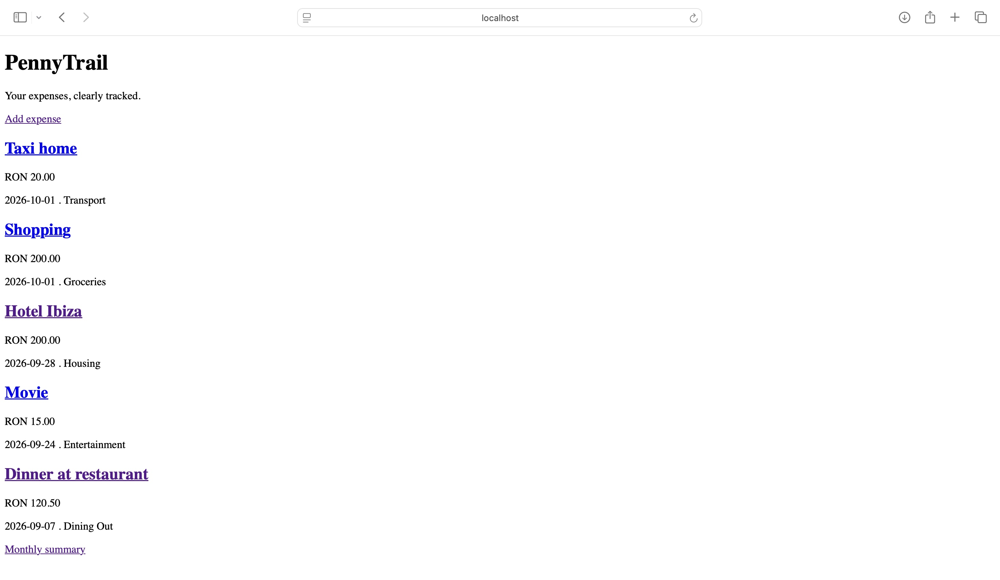
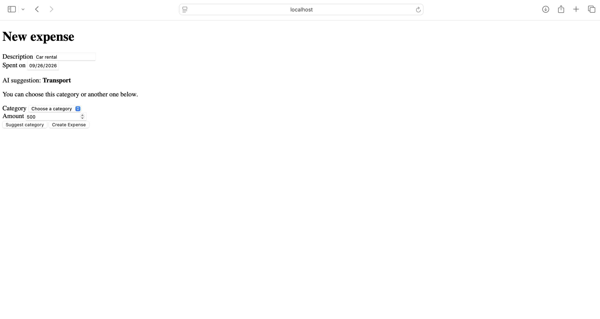
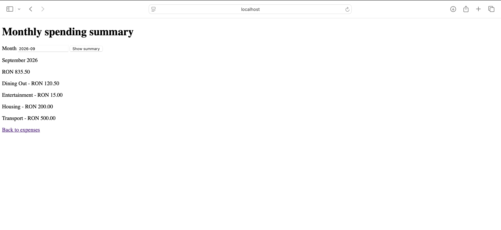

# PennyTrail

A Ruby on Rails expense tracker with AI-powered category suggestions.
Users can track expenses, review monthly spending, and accept or
correct suggestions provided by Google Gemini.

## Features

- Create, view, edit, and delete expenses.
- Choose from predefined expense categories.
- View monthly spending totals and a breakdown by category.
- Request an AI category suggestion based on the description and amount.
- Keep the AI suggestion separate from the final category.
- Invalidate outdated suggestions when the description or amount changes.
- Add expenses manually without requesting an AI suggestion.
- Continue using manual category selection when the AI service is unavailable.

## Tech stack

- Ruby 3.4.1
- Rails 8.1
- PostgreSQL
- Hotwire: Turbo and Stimulus
- Google Gemini API
- Minitest and WebMock
- GitHub Actions

## Local setup

### Requirements

- Ruby 3.4.1
- Bundler
- PostgreSQL installed and running
- A Gemini API key to use AI suggestions

### Installation

```bash
git clone https://github.com/CristinaLazar12/PennyTrail.git
cd PennyTrail
bundle install
bin/rails db:prepare
```

The database configuration uses your local PostgreSQL connection.
Adjust `config/database.yml` if your setup requires different credentials.

### AI configuration

The application reads the API key from the `GEMINI_API_KEY` environment
variable. Set it in the terminal where you will start Rails.

For zsh, enter the following command, then paste your key when prompted:

```zsh
read -s "GEMINI_API_KEY?Paste your Gemini API key and press Enter: "
export GEMINI_API_KEY
```

The key is hidden while typing. This setting applies to the current
terminal session and processes started from it.

Do not commit API keys to the repository.

AI suggestions depend on Gemini API availability and your project's
quota. You can use the application without an API key by selecting
categories manually.

### Start the application

```bash
bin/rails server
```

Open http://localhost:3000.

## Tests and checks

```bash
bin/rails test
bin/rubocop
bin/brakeman --no-pager
```

AI requests are simulated with WebMock in automated tests.
Tests do not require a real API key or consume Gemini API quota.

## How AI suggestions work

1. Enter an expense description and amount.
2. Click **Suggest category**.
3. Review the suggestion and choose the final category.
4. Save the expense.

The application stores the AI prediction separately from the final
category. Changing the description or amount invalidates the previous
suggestion.

If the AI service fails, the form displays a helpful message and allows
manual category selection.

## Current scope

PennyTrail currently runs locally and does not include user
authentication or separate accounts. It is not intended to be exposed
publicly with personal expense data in its current form.

## Screenshots

### Expense list


### AI category suggestion


### Monthly spending summary
